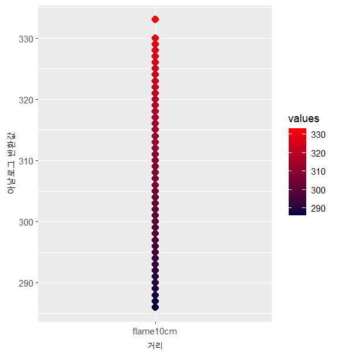
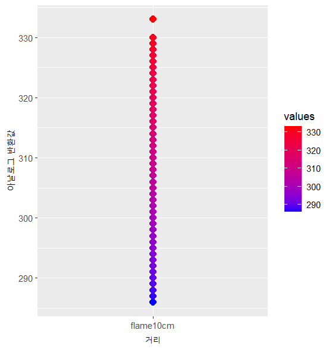
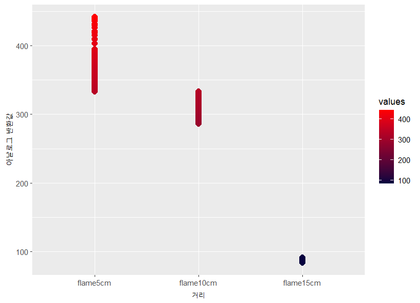
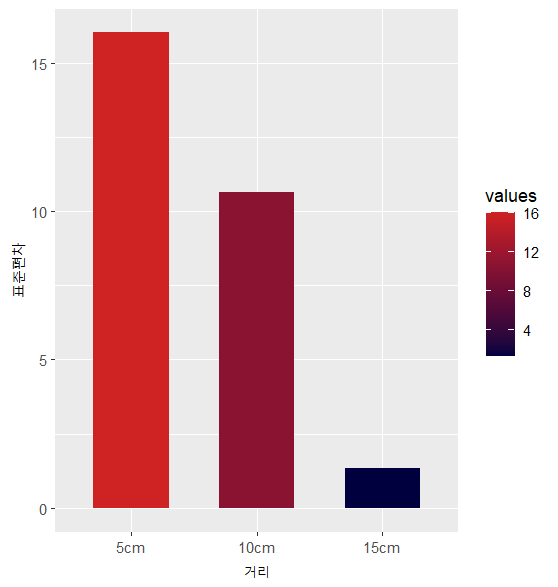

# 프로젝트 소개   

### 쓰레기통과 아두이노를 결합해 창의적 공학 설계를 실습하는 프로젝트 
  

#### 프로젝트 목적  
  1. 사용자의 편의 증진  
  2. 공공의 안전 증진    

##### 설계 구성 품목

  #### 1. 센서(입력장치)  
      1-a. 복수의 화재 감지 센서  
      1-b. 복수의 초음파 센서 
     
  #### 2. 출력장치  
      2-a. LCD 디스플레이 1개  
      2-b. 피에조 부저 1개  
     
  #### 3. 컴퓨터 및 전력  
      3-a. 아두이노 UNO3 보드 1개  
      3-b. 9V 전지 1개  
      3-c. 배럴잭 1개  
      3-d. 복수의 100 Ω ~ 120 Ω 저항 (화재 감지 센서용)  
      3-e. 점퍼 케이블  

  #### 4. 결합-개선을 진행할 쓰레기통     

# R 분석

<table>
  <tr>
    <td width="50%" align="center">
      
       
      그림 1. 10cm 거리에서 측정한 센서 데이터의 산점도 
      아날로그 값 range 51</td>
    <td width="50%" align="center">
      
       
      그림 2. 5cm 거리에서 측정한 센서 데이터의 산점도 
      아날로그 값 range 109</td>
  </tr>
</table>
   
  
<table>
  <tr>
    <td width="90%" align="center">
      
       
      그림 3. 거리에 따른 센서 값 변동 비교</td>
  </tr>
 </table>
  
  
<table>
  <tr>
    <td width="90%" align="center">
      
       
      그림 3-1. 그림3 그래프 확대 
      광원이 가까울수록 아날로그 값의 분산이 커진다</td>
  </tr>
 </table>
   

# 회로도
<table>
  <tr>
    <td width="90%" align="center">
      
       
      회로도 
  </tr>
 </table>
  
        
# 11.25 -> 11.27 개선점  

### 1. 회로 개선
       1-a. 화재 감지 센서의 저항 100Ω -> 10kΩ 으로 변경
       1-b. 저항을 변경함에 따라 코드, 회로도 수정   
 
       
### 2. 데이터 재수집
       1-a. 신규 데이터 수집 -> 시각 자료 변경
