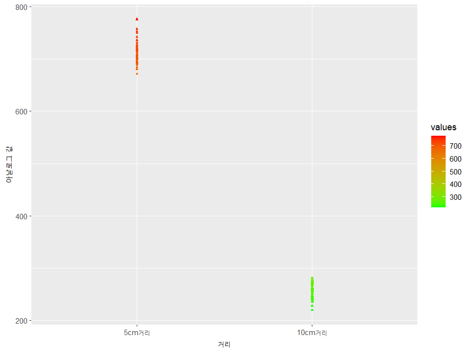

쓰레기통과 아두이노를 결합해 창의적 공학 설계를 실습하는 프로젝트

프로젝트 목적  
  1. 사용자의 편의 증진  
  2. 공공의 안전 증진  

설계 구성 품목

  1. 센서(입력장치)  
      1-a. 복수의 화재 감지 센서  
      1-b. 복수의 초음파 센서  
     
  3. 출력장치  
      2-a. LCD 디스플레이 1개  
      2-b. 피에조 부저 1개  
     
  4. 컴퓨터 및 전력  
      1-c. 아두이노 UNO3 보드 1개  
      2-c. 9V 전지 1개  
      3-c. 배럴잭 1개  
      4-c. 복수의 100 Ω ~ 120 Ω 저항 (화재 감지 센서용)  
      5-c. 점퍼 케이블  

  6. 결합-개선을 진행할 쓰레기통  

  
  

  
